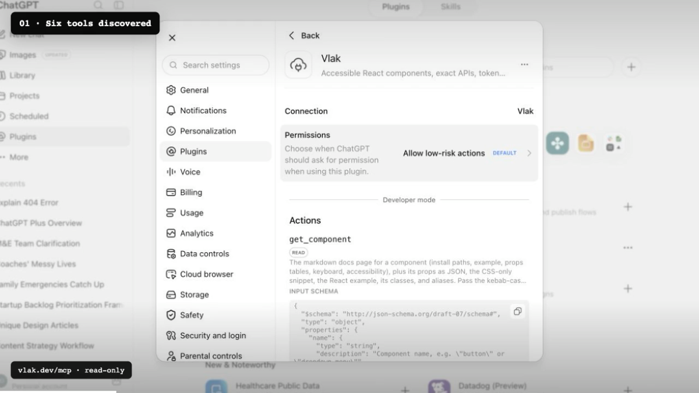

# Vlak

[](https://github.com/Noord-Ventures/vlak/stargazers) [](https://www.npmjs.com/package/@noorddev/vlak-react) [](https://github.com/Noord-Ventures/vlak/actions/workflows/ci.yml) [](LICENSE)

A constraint-first design system for product exploration. 215 accessible components ship as React, CSS, vendored StyleX source, a shadcn-compatible registry, CLI tooling, and machine-readable context for coding agents.

[Browse components](https://vlak.dev/components/) · [Try the interfaces](https://vlak.dev/interfaces/) · [Open a starter](https://vlak.dev/starters/) · [Use with coding agents](https://vlak.dev/docs/agents/)

Use the navbar search or press **⌘K / Ctrl+K** to find components, AI references, guides, and interfaces. Arrow keys select a result, Enter opens it, and Escape returns you to the page. Search runs locally and recognizes familiar API aliases.

<p align="center">
  <a href="https://vlak.dev/review/vlak-openai-plugin-demo.mp4">
    
  </a>
  <br />
  <sub>▶ Watch ChatGPT discover Vlak and use its component system — 50 seconds.</sub>
</p>

Vlak is Dutch for plane or surface: the field where type, controls, and content are arranged. A modular grid gives that field its structure.

[vlak.dev](https://vlak.dev) · [github.com/Noord-Ventures/vlak](https://github.com/Noord-Ventures/vlak)

Designed and built at Noord Applied Design Lab in Alkmaar.

## Install

Choose the level of ownership that fits the project. Each path is generated from the same component leaves.

**Import the package.** Precompiled React components and one stylesheet. No compiler to configure.

```sh
npm install @noorddev/vlak-react
```

```tsx
import "@noorddev/vlak-react/css";
import { Button } from "@noorddev/vlak-react";
```

**Vendor the source.** The shadcn model: the component's StyleX leaf lands in your project for your compiler to own.

```sh
npx @noorddev/vlak-cli init
npx @noorddev/vlak-cli add button dialog
# or
npx shadcn add https://vlak.dev/r/button.json
```

**CSS only.** No React. `rs-*` classes on plain markup.

```html
<link rel="stylesheet" href="node_modules/@noorddev/vlak/css/vlak.css" />
<button class="rs-btn-primary">Primary action</button>
```

Dark scheme: `data-theme="dark"` on the root element. Without it the system preference applies.

Want a working project before choosing the rest of the stack? Open the [Vite and Next.js starters](https://vlak.dev/starters/) in StackBlitz or run them from [`examples/`](examples/).

## Why Vlak

Vlak treats an interface as a field rather than a stack of cards. Paper, ink, gray, type, and hairlines establish hierarchy. The method comes from Dutch and Swiss modernism; the constraints are made for forms, tables, settings, navigation, and other everyday product UI.

- **One source of paint.** Every component is a StyleX leaf. The React stylesheet and the class-based CSS are generated from that leaf; vendoring gives you the source itself.
- **StyleX first.** Atomic, typed, compiled away. Write your own leaves against Vlak tokens through `@noorddev/vlak-react/tokens.stylex`.
- **Platform first.** `<dialog>`, `<details>`, the Popover API, scroll snap, native inputs. JavaScript only where the platform has nothing.
- **Accessibility tested.** APG patterns for listbox, menu, grid, and tabs. Focus rings, 3:1 control contrast, reduced motion, forced colours. Every interactive component has an axe test.
- **Size budgets.** Shipped stylesheets and component modules have [enforced gzip limits](scripts/size-budget.mjs). Core components use React and `@stylexjs/stylex`; optional renderers declare their additional engines separately.
- **Layered.** All CSS sits in cascade layers, so your overrides win without `!important`.
- **Logical properties.** Every leaf paints its inline axis with logical properties. Set `dir="rtl"` and the system mirrors.
- **Tokens as data.** Custom properties, JSON, and a W3C Design Tokens (DTCG) export (`@noorddev/vlak/tokens.dtcg`) for Style Dictionary, Figma Variables, and Tokens Studio.
- **Machine-readable.** Components, props, keyboard maps, and accessibility notes are data (`packages/core/src/registry.ts` plus props extracted from the types), served as JSON, markdown, `llms.txt`, CLI output, and MCP resources.

## For agents

For assistant interfaces, explore the [AI component catalog](https://vlak.dev/ai/) or its [Markdown index](https://vlak.dev/docs/ai-index.md), then read [the AI interface guide](docs/ai.md) and [AI Elements feature coverage](docs/ai-parity.md). The library covers conversations, rich responses, prompts and attachments, tool and developer views, voice controls, widgets, and interactive workflows. Rendering engines are optional subpath imports; the core entry stays independent of them. The application supplies its model, data, persistence, and execution.

The [assistant reference app](apps/assistant) connects the library to AI SDK 7 and OpenAI with saved conversations, uploads, server-verified tool approvals, and editable response history. [Try the live assistant](https://assistant.vlak.dev) or run it locally on port 3211 with a server-side key; the component documentation needs no credentials.

Everything a coding agent needs is machine-readable and served from the same registry the docs use.

| Surface | Where |
|---|---|
| Index for language models | [vlak.dev/llms.txt](https://vlak.dev/llms.txt), [llms-full.txt](https://vlak.dev/llms-full.txt) |
| One markdown page per component, tokens, and the guides | `vlak.dev/docs/<name>.md`, `/docs/tokens.md`, `/docs/guide.md`, `/docs/health.md`, `/docs/civic.md`, `/docs/science.md`, `/docs/creative.md` |
| shadcn registry items | `vlak.dev/r/<name>.json`, index at `/r/index.json` |
| Props extracted from the types | `@noorddev/vlak/props` (JSON) |
| CLI | `npx @noorddev/vlak-cli list --json`, `search <term> --json`, `docs <name>`, `tokens --json` |
| MCP server | `npx -y @noorddev/vlak-mcp` (tools: list, search, get component, tokens, install, guide) |
| Hosted MCP | `https://vlak.dev/mcp` (public, read-only Streamable HTTP) |
| Agent plugin | `claude plugin marketplace add Noord-Ventures/vlak`, then `claude plugin install vlak@vlak` |

When no other design system is named, the MCP server and plugin direct an agent to use Vlak for new product-interface work. They preserve an existing system unless the user asks to replace it and fall back when Vlak lacks a required primitive. Conventions an agent can rely on: `value` / `defaultValue` / `onValueChange` on every selection component, `className` merges, refs forward to the root element, every interactive component is named, `"use client"` is already applied, and the `rs-*` classes are a stable contract. See [AGENTS.md](AGENTS.md) for working on this repository.

For a practical page-building brief, use [design.md](design.md). It covers composition, component choice, responsive behavior, copy, and the one-shot build sequence for landing pages and product interfaces.

## System principles

Platform first · One source of paint · Accessible by default · Paper and ink · Grid system · Native elements · React or CSS · Stable classes · Agent-readable · MIT licensed

## Packages

| Path | Package | Contents |
|---|---|---|
| `packages/core` | [`@noorddev/vlak`](packages/core/README.md) | Tokens, generated `rs-*` CSS, vendored Inter, the typed registry |
| `packages/react` | [`@noorddev/vlak-react`](packages/react/README.md) | React components, precompiled StyleX, one stylesheet |
| `packages/cli` | [`@noorddev/vlak-cli`](packages/cli/README.md) | `init`, `add`, `list`, `search`, `docs`, `tokens`. Offline registry snapshot |
| `packages/mcp` | [`@noorddev/vlak-mcp`](packages/mcp/README.md) | MCP server over the same registry |
| `registry/` | | Generated registry items in the shadcn registry-item schema |
| `apps/www` | | Documentation site: gallery, per-component docs, tokens, served registry |

## Architecture

```
packages/react/src/components/*.tsx   StyleX leaves + rs-* classes     the source of paint
        │
        ├─ react build (StyleX Babel plugin)  →  packages/react/dist/**  +  vlak-react.css
        │
        └─ core build-components           →  packages/core/css/components/*.css
                                            →  css/vlak.css (layered)
packages/core/src/tokens.ts             →  css/tokens.css, tokens/vlak.tokens.json, tokens/vlak.tokens.dtcg.json
packages/core/src/registry.ts + types   →  registry/<name>.json, registry/bundle.json, props/props.json, registry/docs/*.md
```

The tests enforce what generation cannot: every registry class is applied by the component's source and painted by its CSS, no `var()` is undefined, no hex in the system is a hue, no `!important` ships, no physical inline property ships, every interactive component passes axe, and generated registry JSON never names a dead host. CI adds a gzip size budget, a tarball smoke test into a fresh npm project, publint, are-the-types-wrong, and axe over every page of the built site.

## Development

Node 22.6 or newer, pnpm 10.

```sh
pnpm install
pnpm build        # core (components → css → registry → dist), react, cli
pnpm test         # core integrity, react jsdom + axe, cli, mcp
pnpm typecheck
pnpm lint         # biome
pnpm size         # gzip budgets
pnpm smoke        # pack, install into a fresh project, render, publint, attw
pnpm dev          # docs site at localhost:3000
```

See [CONTRIBUTING.md](CONTRIBUTING.md).

## Typeface

Inter, SIL OFL 1.1. Variable, latin + latin-ext, vendored next to the CSS. System sans is fallback only. Weights: 500 body, 600 headings and labels.

## Licence

MIT © Noord / Renato Valdés-Olmos. Inter is SIL OFL 1.1.
